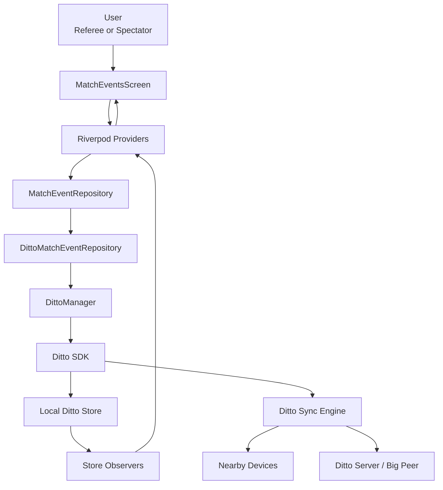

# Local-First Match Tracker

Local-First Match Tracker is a Flutter demo app for learning the Ditto SDK through a soccer match-tracking use case.

The app is intentionally small, but it is built around a real offline-first idea:

> A referee, assistant referee, coach, or spectator can open the same match on separate devices. Match events are written locally first, then Ditto syncs those changes across nearby peers and/or Ditto Server when connectivity is available.

This project is not trying to become a full production sports platform on day one. It is a learning app for understanding Ditto 5.1, local-first data, sync subscriptions, peer-to-peer behavior, and app architecture.

## Current status

The current app supports:

- choosing a role when the app opens: referee or spectator
- creating, selecting, and deleting match sessions
- starting and ending the first or second half
- recording goals, cards, offsides, and substitutions
- selecting teams and players for events
- displaying 18-player team rosters with starters and bench players
- showing a synced match event timeline
- showing a broadcast-style multi-game dashboard for demo screen sharing
- opening Ditto Tools on native devices to inspect peers, sync status, DQL data, permissions, system settings, and storage
- running on Android, iOS, and Flutter Web, with the strongest mesh behavior on physical mobile devices

## Why Ditto matters in this app

Ditto is the local-first database and sync layer.

In normal apps, a phone usually writes to a backend server first. If there is no internet, the app may fail or wait.

In this app, a match event is written to the local Ditto store first:

```text
referee taps Goal
→ app writes a match_events document locally
→ local UI updates immediately
→ Ditto syncs the document to other peers later
```

That means the app can keep working at a field, gym, school, or mesh lab even when the network is weak.

Ditto owns:

- the local database on each device
- peer-to-peer sync
- server sync when Ditto Server is configured
- sync subscriptions
- presence and transport information
- field-level merge behavior for synchronized documents

The Flutter app owns:

- screens and buttons
- role-based UI
- soccer-specific business rules
- DQL statements for match data
- deciding which documents this app cares about

The important mental model is:

```text
DittoManager configures Ditto.
Repositories use Ditto.
Screens use repositories.
Users interact with screens.
```

## Architecture



### Main pieces

| Layer | File | Responsibility |
| --- | --- | --- |
| App entry | `lib/main.dart` | Starts Flutter and loads the app. |
| App shell | `lib/app/app.dart` | Creates the app-level widget structure. |
| Theme | `lib/app/match_tracker_theme.dart` | Defines football-themed light and dark mode. |
| Design tokens | `lib/design/match_center_tokens.dart` | Centralizes the Option C broadcast colors and Oswald/Chivo typography. |
| Providers | `lib/app/providers.dart` | Wires app state, repositories, and Ditto objects into Riverpod. |
| Ditto setup | `lib/ditto/ditto_manager.dart` | Opens and configures the Ditto SDK instance. |
| Repository contract | `lib/repositories/match_event_repository.dart` | Defines what the app can do with match data. |
| Ditto repository | `lib/repositories/ditto/ditto_match_event_repository.dart` | Runs DQL queries, writes documents, and observes synced data. |
| Main feature UI | `lib/features/match_events/match_events_screen.dart` | Lets users choose a role, create/select matches, control halves, and log events. |
| Dashboard UI | `lib/features/match_dashboard/match_dashboard_view.dart` | Renders the Option C broadcast dashboard, match cube grid, live feed, and Ditto presence summary. |
| Role model | `lib/domain/app_role.dart` | Defines referee and spectator roles. |
| Match state model | `lib/domain/match_control.dart` | Represents half, status, timer, and match clock behavior. |
| Event model | `lib/domain/match_event.dart` | Represents goals, cards, offsides, substitutions, and event metadata. |
| Player model | `lib/domain/player.dart` | Represents team rosters, starters, bench players, and player selection. |

## Broadcast dashboard UX

The dashboard uses Option C from the Claude Design references as its visual direction:

- near-black stadium-board background
- lime live-state accent
- Oswald condensed display typography for scores and headings
- Chivo interface typography for labels and body copy
- a featured match panel with an oversized score
- smaller match cubes for the rest of the games
- a right rail for a chronological team-sided event timeline and live pitch status
- a dark broadcast-themed role-selection page

The dashboard is still powered by Ditto data. It reads the synchronized `matches` and `match_events` collections through the same Riverpod providers as the referee workflow. No fake dashboard-only state is introduced.

Timeline events are positioned by `teamSide`: home-team events render to the left of the center line, away-team events render to the right, and neutral events stay centered.

## Data model

The app currently uses two main Ditto collections.

### `matches`

A match document represents one game.

Example shape:

```json
{
  "_id": "match-abc123",
  "name": "Green FC vs Blue FC",
  "homeTeamName": "Green FC",
  "awayTeamName": "Blue FC",
  "status": "firstHalf",
  "selectedHalf": "first",
  "elapsedSeconds": 620,
  "clockStartedAtMillis": 1788290100000,
  "createdAtMillis": 1788290000000,
  "updatedAtMillis": 1788290100000
}
```

### `match_events`

A match event document represents one thing that happened during a match.

Example goal:

```json
{
  "_id": "event-abc123",
  "matchId": "match-abc123",
  "type": "goal",
  "teamName": "Green FC",
  "playerId": "green-7",
  "playerName": "Green Player 7",
  "minute": 34,
  "createdAtMillis": 1788291234567
}
```

Example substitution:

```json
{
  "_id": "event-def456",
  "matchId": "match-abc123",
  "type": "substitution",
  "teamName": "Blue FC",
  "playerOutId": "blue-4",
  "playerOutName": "Blue Player 4",
  "playerInId": "blue-14",
  "playerInName": "Blue Player 14",
  "minute": 66,
  "createdAtMillis": 1788295555555
}
```

## Why multiple games work

Every match has its own `_id`.

Every event stores the `matchId` it belongs to.

So the Ditto database can contain many games at once:

```text
matches
  match-1
  match-2
  match-3

match_events
  event-a → matchId: match-1
  event-b → matchId: match-1
  event-c → matchId: match-2
```

The app shows only the events for the selected match by querying `match_events` with the active `matchId`.

## Role behavior

The app currently has two roles:

### Referee

The referee can:

- create games
- delete games
- select a match
- start and end halves
- record goals
- record cards
- record offsides
- record substitutions

### Spectator

The spectator can:

- select a match
- view score and match status
- view the event timeline

The spectator role is currently a UI-level permission. That means the buttons are hidden in the app, but it is not yet a secure authorization system. A future production version should enforce permissions using Ditto authentication, sync scopes, or backend-issued credentials.

## Ditto SDK concepts used

### `DittoConfig`

Used to decide how the local Ditto instance should open.

In this app, credentials are passed with `--dart-define` values so secrets are not committed into the repo.

### `Ditto.open(...)`

Creates the Ditto instance on the device.

Each phone, tablet, browser, or laptop running the app becomes a Ditto peer.

### `ditto.store.execute(...)`

Runs DQL statements for reading and writing local Ditto documents.

The app uses DQL for operations like:

- inserting a match
- updating match control state
- inserting a match event
- deleting match events
- deleting a match

### Sync subscriptions

Subscriptions tell Ditto which documents this device wants to sync.

For this app, the important synced data is:

- match documents
- match event documents

### Store observers

Observers update the UI when local query results change.

This is what makes the app feel live:

```text
another device writes an event
→ Ditto syncs it here
→ local store changes
→ observer fires
→ Flutter UI rebuilds
```

### Presence

Presence helps inspect which peers and connections are currently visible.

Presence does not decide what data syncs. Data visibility is controlled by database ID, credentials, sync scopes, and subscriptions. Presence tells the app what peers/connections are currently available.

## Running the app

Install dependencies:

```bash
flutter pub get
```

List devices:

```bash
flutter devices
```

Run on a specific Android or iOS device:

```bash
flutter run -d your-device-id \
  --dart-define=DITTO_DATABASE_ID=your-database-id \
  --dart-define=DITTO_SERVER_URL=https://your-ditto-server-url \
  --dart-define=DITTO_PLAYGROUND_TOKEN=your-development-token
```

Use the same Ditto database ID, server URL, and token on every device that should join the same test.

Run the web dashboard locally for screen sharing:

```bash
flutter run -d chrome \
  --web-hostname=localhost \
  --web-port=8080 \
  --dart-define=DITTO_DATABASE_ID=your-database-id \
  --dart-define=DITTO_SERVER_URL=https://your-ditto-server-url \
  --dart-define=DITTO_PLAYGROUND_TOKEN=your-development-token
```

Then open:

```text
http://localhost:8080
```

The browser is useful as a projector/dashboard view. Physical Android and iOS devices are still better for validating native mesh transports like Bluetooth and local peer discovery.

## Running multiple devices

For a two-device test:

1. Connect device one to the Mac.
2. Run the app on device one as referee.
3. Disconnect device one if needed.
4. Connect device two to the Mac.
5. Run the app on device two as spectator.
6. Keep Wi-Fi and Bluetooth enabled on both devices.
7. Use the same Ditto credentials on both devices.
8. Create or select the same match.
9. Log an event on the referee device.
10. Watch for the spectator device to receive it.

Important: “offline” does not mean turning every radio off.

For local peer-to-peer sync, devices still need a transport such as Bluetooth, local Wi-Fi, LAN, AWDL, or Wi-Fi Aware. A Wi-Fi router can have no internet connection and still allow devices to talk locally.

## Ditto Tools

The app includes the `ditto_flutter_tools` package for native-device demos.

On native Android or iOS, tap the tools icon in the top app bar or open Match Detail and tap **Open Ditto Tools** in the Ditto status card to inspect:

- visible peers
- peer sync status
- DQL query results
- local permission health
- system settings
- Ditto storage/log export tools

Ditto Tools is intended for native targets such as Android and iOS. The Flutter Web build is still useful as the dashboard/screen-share view, but the official Ditto Tools UI is disabled there.

## iOS notes

iOS requires local network and Bluetooth permissions for native local discovery and sync behavior.

The app includes iOS permission descriptions in:

```text
ios/Runner/Info.plist
```

If iOS local sync is not working, check:

- Settings → Privacy & Security → Local Network
- Settings → Bluetooth
- whether the app has been granted permission
- whether both devices use the same Ditto credentials
- whether Wi-Fi and Bluetooth are enabled

## Android notes

Android is usually the easier first target for mesh-lab testing.

Before running on Android:

```bash
flutter doctor
flutter devices
```

Make sure USB debugging is enabled and the phone/tablet authorizes the Mac.

## Current limitations

This is still a prototype.

Known limitations:

- roles are UI-only, not secure permissions
- rosters are demo/generated rosters, not user-created teams yet
- there is no assistant-referee-specific workflow yet
- there is no coach/statkeeper workflow yet
- conflict-resolution tests are not fully built yet
- there is no polished match setup wizard yet
- the app does not yet model every soccer rule

## Recommended next features

Build this app one feature at a time.

Good next steps:

1. Team setup
   - create teams
   - edit team names
   - add real players
   - mark starters and bench players

2. Assistant referee mode
   - allow offsides and notes
   - restrict official score changes
   - show pending events for main-ref approval

3. Coach/statkeeper mode
   - log tactical events
   - track possession notes
   - view live play-by-play

4. Conflict test harness
   - simulate two devices recording the same goal
   - simulate offline edits
   - verify every peer converges to the same match state

5. Better Ditto observability
   - show peer count
   - show sync status
   - show last event received from another device
   - surface useful Ditto transport conditions

## Development checks

Run these before pushing larger changes:

```bash
dart format lib test
flutter analyze
flutter test
flutter build apk --debug
flutter build web
```

For iOS build validation without installing on a phone:

```bash
flutter build ios --debug --no-codesign
```

## Learning goal

The point of this repo is not just “make a soccer app.”

The point is to learn how Ditto changes app design:

- devices can write locally first
- apps do not need to block on the cloud
- multiple peers can converge after reconnecting
- the local database is the source of truth for the UI
- sync behavior becomes part of the product experience

That is the engineering story this project should show.
